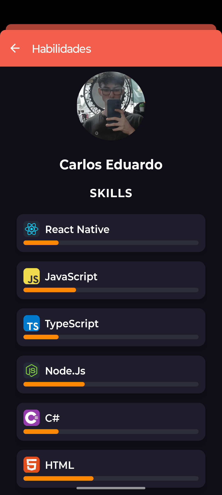
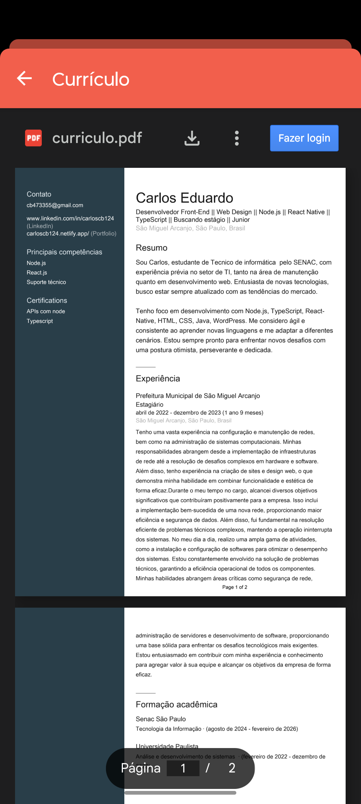

# 📱 Portfólio em React Native

Este projeto é um **Portfólio Mobile** desenvolvido em **React Native com TypeScript**, criado como parte de um desafio prático para mostrar perfil e habilidades.

## 🚀 Funcionalidades

* **Main Screen (Perfil)**

  * Foto do usuário
  * Nome em destaque
  * Links clicáveis: GitHub, LinkedIn e Email
  * Navegação para a tela de Skills

* **Skills Screen (Habilidades)**

  * Foto e nome do usuário
  * Subtítulo "Skills"
  * Cards de habilidades com ícones e barra de progresso
  * Animação suave na entrada dos cards

## 📱 Capturas de Tela

<div align="center">
  
| Perfil | Habilidades |
|--------------|------------|
|  |  | 

</div>

## 🎨 Tecnologias Utilizadas

* [React Native](https://reactnative.dev/)
* [TypeScript](https://www.typescriptlang.org/)
* [React Navigation](https://reactnavigation.org/)
* [Expo](https://expo.dev/)

## 📂 Estrutura do Projeto

```
Portifolio-React-Native/
├── assets/             # imagens e ícones
├── src/
│   ├── Screens/        # telas: MainScreen, SkillsScreen
│   ├── Styles/         # arquivos de estilo
│   └── ...
├── App.tsx
└── README.md
```

## ⚙️ Como rodar

1. Clone o repositório:

```bash
git clone https://github.com/Carloscb124/Portifolio-React-Native.git
```

2. Entre na pasta do projeto:

```bash
cd Portifolio-React-Native
```

3. Instale as dependências:

```bash
npm install
```

4. Rode o projeto:

```bash
npx expo start
```

5. Abra no celular usando o app **Expo Go** ou em um emulador Android/iOS.

## 💡 Melhorias Futuras

* Adicionar animações mais avançadas entre telas
* Barra de progresso animada para as skills
* Cards de skills renderizados dinamicamente a partir de um array ou JSON
* Mais seções de portfólio (projetos, certificados)

## 👨‍💻 Autor

**Carlos Eduardo**

* GitHub: [https://github.com/Carloscb124](https://github.com/Carloscb124)
* LinkedIn: [https://www.linkedin.com/in/carloscb124/](https://www.linkedin.com/in/carloscb124/)
